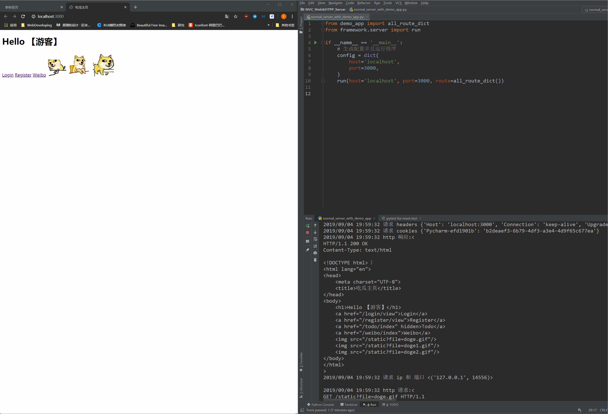
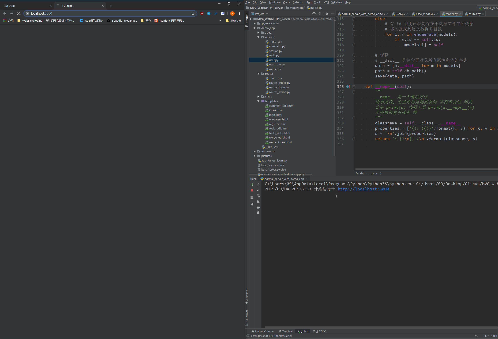

# 自制 HTTP & WSGI Server 与 MVC Web 框架

## 功能演示
- 请求解析
  
- 响应
  
- 登陆权限验证装饰器
  
- 完整功能展示
  

## 功能介绍
- MVC Web 框架
   - Model 框架层：使用 MySQL ，自制ORM（对象关系映射）实现增删改查的原生SQL语句封装。
   - View 视图层：使用 Jinja2 渲染模板实现数据的有序显示，提高开发效率。
   - Controller 控制器：使用 Python 高阶函数，实现路由注册、页面路由的分发、权限验证等高级功能。
     包含数据实例化、重定向、特定格式数据（HTML、JSON）返回等辅助功能。

- HTTP & WSGI Server
  - 基于 Socket 实现 HTTP 服务器，负责监听网络请求和转发响应
    - HTTP
      解析并重新拼接原生 HTTP 请求。
    - WSGI
      支持 WSGI 协议，配合 Gunicorn 应用服务器对自制 MVC Web 框架进行托管。
      具备清洗 WSGI 请求数据的清洗功能，可成功解析基于 WSGI 的请求并响应。
      该清洗数据功能可根据不同协议进行调整，增加服务器灵活性 
  - 数据经服务器转发至框架之后，经过请求解析、路由分发等过程，再由服务器将响应发送至客户端。
  - 使用多线程实现并发访问。
